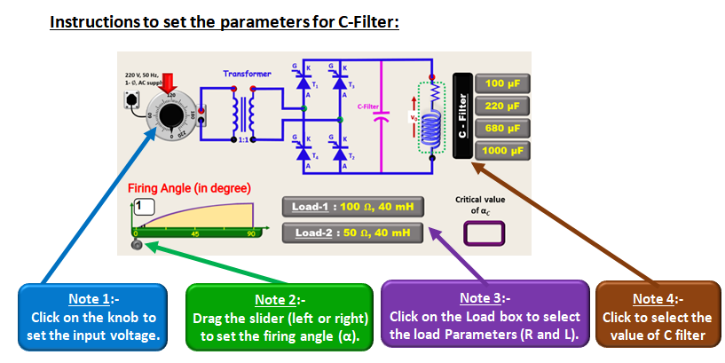
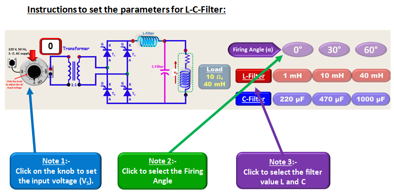
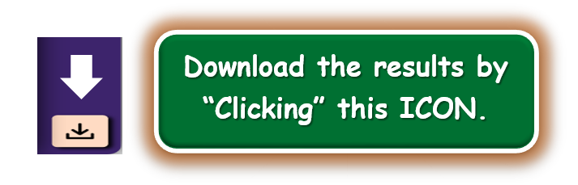

### Procedure

  

 

  

 
#### a) Circuit formulation: 
1. Connect the circuit to form a single-phase controlled Bridge Rectifier with C-filter and LC-filter 
2. Click on “CHECK” button to verify the circuit. 
3. a). If all connections are correct then click on “NEXT” button and proceed for experimentation. 
b). If connections are wrong, press the “RESET” button and reconnect the terminals to create the correct circuit. 

#### b) Operating the circuit: 
1. To see the waveforms for different firing angles select the type of filter and firing angle. 

#### c) Performance analysis of the circuit: 
#### C-Filter 
1. Set the source voltage. 
2. Select the load followed by value of capacitor filter.  
3. Change the firing angle and click on “RECORD” button to fill the table. 
4. Click on respective “ICONS” to see the various plots for performance analysis. 

#### LC-Filter 
1. Set the source voltage. 
2. Activate the load (by clicking on it)  
3. Select the firing angle followed by L and C filter values to fill the observation table 
4. Click on respective “ICONS” to see the various plots for performance analysis. 

  

