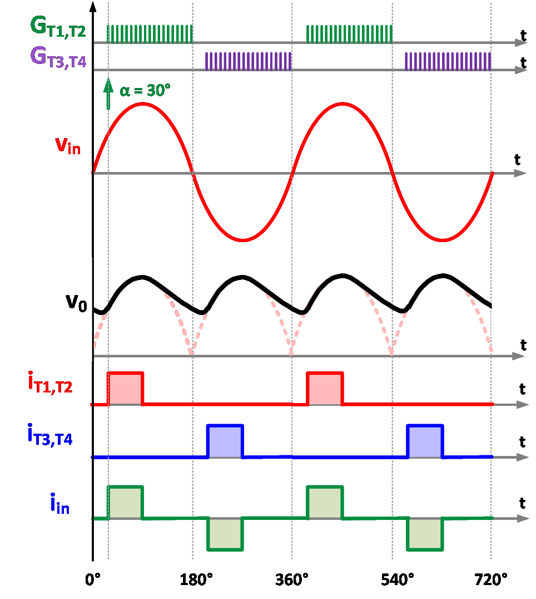
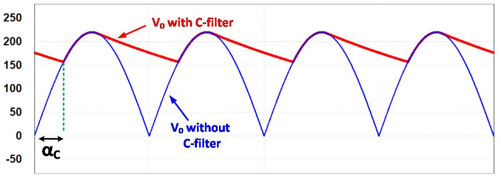

### Theory

The circuit configuration of singe-phase controlled bridge rectifier is given in Fig. 1. 

  
  
Fig. 1. Circuit configuration of single-phase controlled bridge rectifier.

 
The controlled-bridge rectifier is shown in Fig. 1 feeding the power to the load. Due to rectifier operation the load voltage is rectified AC exhibiting high peak-to-peak ripple voltage. To reduce the peak-to-peak ripple it is necessary to connect low-pass filter circuits between bridge and load and they are: (a) C-filter, (b) L-filter and (c) LC-filter. Among these filter configurations, C-filter and LC-filter structures are effective in reducing the peak-to-peak content and hence their brief description is given in the following paragraphs. 

The capacitor filter is a cost-effective and widely used filter configuration. The diagram illustrating the configuration of the capacitor filter is shown in Fig. 2. The capacitor charges to the peak value of the input voltage and tries to maintain this level while the AC input decreases to zero. The capacitor will discharge through the load until the input voltage reaches to a level higher than the voltage across the capacitor. At this point, the rectifier will once again recharge the capacitor. The ripple voltage across the filter capacitor is a function of the filter capacitance value, AC supply frequency and the load current. 
 

  
  
 Fig.2. Circuit configuration of single phase controlled bridge rectifier with C-filter

 
The rectifier with LC-filter configuration incorporates an additional inductor between the rectifier and the capacitor filter. The inductor absorbs the ripple voltage and thus results in a smoothing effect leading to a decrease in the output voltage ripple as compared to the capacitor filter alone.
 

  
  
 Fig.3. Circuit configuration of single-phase controlled bridge rectifier with LC-filter.

 
Typical waveforms for controlled bridge rectifier with C-filter is given in Fig. 4 

<table border="0" align="center" style="width:100%; border:none;">
  <tr>
<td style="width:50%">

  
(a)
  

</td>
<td style="width:50%">
  

  
(b)
  

 
    </td>
  </tr>
  <tr>
<td colspan="2" style="width:100%; background-color: #FFF;">

  
(c)
  

</td>
  </tr>

</table>
 

 
Fig. 4. Typical waveforms for controlled rectifier with C-Filter (a) α = 0&#176;, (b) α = 30&#176; and (c) α = 60&#176;.
  

 Typical waveforms for controlled bridge rectifier with LC-filter is given in Fig. 5 

<table border="0" align="center" style="width:100%; border:none;">
  <tr>
<td style="width:50%">

  
(a)
  

</td>
<td style="width:50%">
  

  
(b)
  

 
    </td>
  </tr>
  <tr>
<td colspan="2" style="width:100%; background-color: #FFF;">

  
(c)
  

</td>
  </tr>

</table>
 

 
Fig. 5. Typical waveforms for controlled rectifier with L-C-Filter (a) α = 0&#176;, (b) α = 30&#176; and (c) α = 60&#176;.
  

 

#### C-Filter 

 

 
  
Various mathematical expressions are given below to quantify the rectifier performance parameters. Average voltage appearing across load is defined by 

  

    ..(1)

 

Average load current is given by

  
      

    ..(2)

 

 
where, 

  
      

    ..(3)

 

 
The peak-to-peak ripple in output voltage is given by

  
      

    ..(4)

 

 
  The AC component in rectifier output voltage is given by

 

  
      

    ..(5)

 

 
The ripple factor is given by

 

  
      

    ..(6)

 

 
If the firing angle of controlled rectifier with C-filter is less than the critical value of firing angle (αc) then the rectifier works as an uncontrolled rectifier and the firing angle change in this range will not affect the nature of output voltage waveform as shown in Fig. 6. However, when the firing angle is higher than “αc” then the load voltage linearly decreases with firing angle. 
 

 

  
  
 Fig. 6. Output load voltage with and without capacitor filter.

 

 

#### LC-Filter 

 

 
Various mathematical expressions are given below to quantify the rectifier performance parameters. Average voltage appearing across load is defined by
 

  
      

    ..(7)

  

 
The peak-to-peak ripple in output voltage is given by
 

  
      

    ..(8)

 
  

 
where V0_2h  is the 2nd harmonic (dominating harmonic) component. 
The ripple factor is given by
 

  
      

    ..(9)

 
